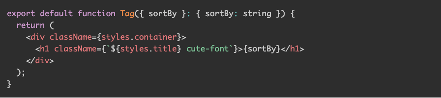
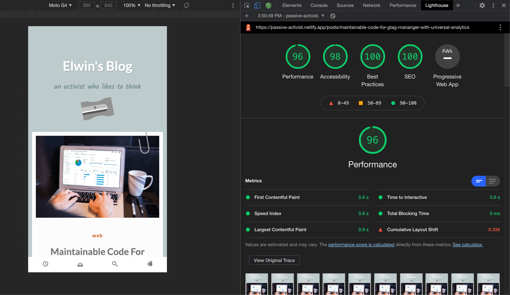

This is the front end repo for my blog website, the backend repo is private. check my [blog post](https://passive-activist.netlify.app/posts/use-strapi-next-to-bootstrap-your-blog-site) if you want to know more

## Features

- **Syntax highlighting on markdown data:** so I can increase the readability of the Fenced Code Blocks in my post:

  
- **High score on Lighthouse audition:** achieved by using the 'Static Generation' from Next.js and small bundle size(using webpack 5, and only include necessary libraries).

  
- **With code quality in mind:** auto lint codes with **Eslint**, **Prettier**, **Stylelint** before commit, use **Code Climate** to get automated code review comments.

## License

- **[MIT license](http://opensource.org/licenses/mit-license.php)**
